# Pipeline de Análise Reprodutiva Pecuária

Sistema de **8 agentes sequenciais** para análise de dados reprodutivos bovinos, com integração a fontes de dados reais (IBGE SIDRA, BCB/SGS, IPEADATA).

> **Por que isso importa?**
> Falhas reprodutivas custam entre R$ 5 e R$ 12 por dia aberto por vaca. Em um rebanho de 500 animais com 30 dias de excesso de dias abertos, a perda supera **R$ 90.000/ciclo** — invisível sem análise de dados.

---

## Fontes de dados reais integradas

Este pipeline combina **três camadas de dados reais** com dados sintéticos calibrados cientificamente:

### 1. IBGE SIDRA — contexto regional real
- **O que busca:** efetivo do rebanho bovino e produção de leite por município
- **Tabelas:** PPM 3939 (bovinos, cabeças) e PPM 74 (leite, mil litros)
- **API oficial:** `https://servicodados.ibge.gov.br/api/v3/agregados`
- **Como usar:** inclua a coluna `municipio` no dataset (código IBGE de 7 dígitos) para ativar a análise municipal — o pipeline busca o rebanho regional e compara com o desempenho da fazenda

### 2. BCB/SGS + IPEADATA — preços ao vivo
- **Boi gordo:** Banco Central do Brasil — série SGS 4452 (R$/arroba)
- **Leite:** BCB/SGS série 4390 (R$/litro)
- **Fallback:** IPEADATA REST API → parâmetros CNA 2024 se APIs indisponíveis
- **Uso:** o `EconomicImpactAgent` usa o preço real para calcular custo do dia aberto e ROI de programas reprodutivos

### 3. Dados sintéticos calibrados (Embrapa / CNA / ABIEC)

Registros individuais de animais **não existem em bases públicas** — são dados clínicos de fazenda. O pipeline gera 1.200 registros sintéticos com parâmetros da literatura científica brasileira:

| Parâmetro | Benchmark | Fonte |
|---|---|---|
| Taxa de concepção (Nelore extensivo) | 55–65% | Embrapa Gado de Corte |
| Taxa de concepção (Girolando IATF) | 50–60% | Rev. Bras. Reprod. Anim. |
| Dias abertos médios (corte) | 120–160 dias | CNA / ABIEC |
| IEP médio nacional | 420–450 dias | Embrapa / Anuário ABIEC 2023 |
| ECC médio ao serviço | 2,8–3,2 | Embrapa |
| Custo dia aberto (corte) | R$ 4–8 | CNA 2024 |
| Custo dia aberto (leite) | R$ 7–12 | Embrapa/CNA 2024 |

Os dados reproduzem biologicamente: relação ECC × concepção (regressão logística), efeito de paridade, sazonalidade, variabilidade entre técnicos e distribuição realista de raças (Nelore 40%, Angus 20%, Girolando 20%, Senepol 10%, Brangus 10%).

---

## Arquitetura do pipeline

```
orchestrator.py
     │
     ├─ DataEngineerAgent      Carga + normalização de colunas + engenharia de features
     ├─ DataQualityAgent       Valores ausentes, duplicatas, outliers, imputação
     ├─ EDAAgent               KPIs reprodutivos + análise municipal via IBGE SIDRA
     ├─ HypothesisAgent        Qui-quadrado / Mann-Whitney / ANOVA
     ├─ ModelingAgent          Regressão Logística + Random Forest + Gradient Boosting
     ├─ EconomicImpactAgent    Custo do dia aberto + ROI com preços BCB/IPEADATA
     ├─ VisualizationAgent     10 gráficos → outputs/plots/
     └─ ReportingAgent         Relatório HTML + resumo Markdown → outputs/reports/
```

---

## Visualizações geradas

Cada gráfico inclui benchmarks reais (Embrapa / CNA / ABIEC) como linhas de referência.

---

### 1 · Taxa de Concepção por Grupo
**O que mostra:** comparação da taxa de prenhez por raça, estação, fazenda e técnico.
**Referências:** linha tracejada = média do rebanho | linha pontilhada verde = meta Embrapa (60%)
**Para que serve:** identificar quais grupos estão abaixo da meta e priorizar intervenções.

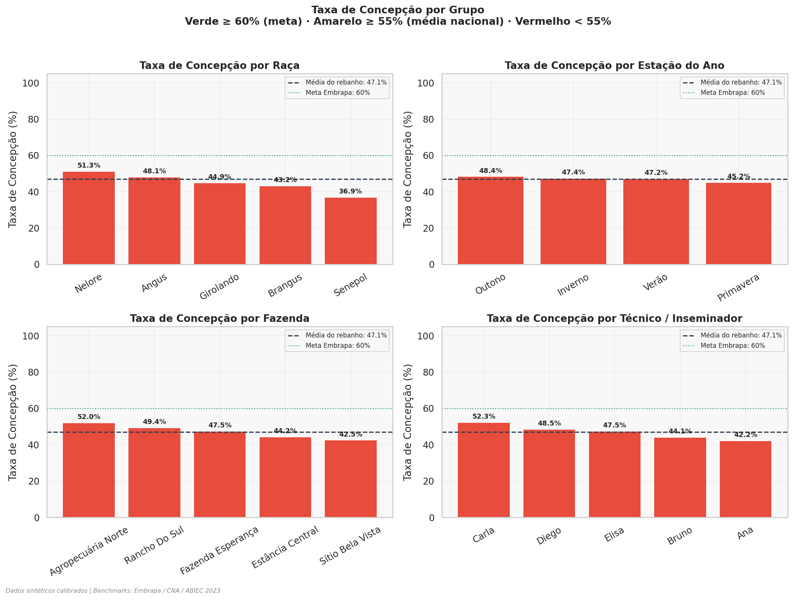

---

### 2 · ECC × Concepção
**O que mostra:** como o Escore de Condição Corporal (ECC) se relaciona com o resultado reprodutivo.
**Referências:** ECC ideal ao serviço = 3,0 (Embrapa) | meta de concepção = 60%
**Para que serve:** o ECC é o principal preditor individual de prenhez — vacas abaixo de 2,5 têm taxa até 30% menor.

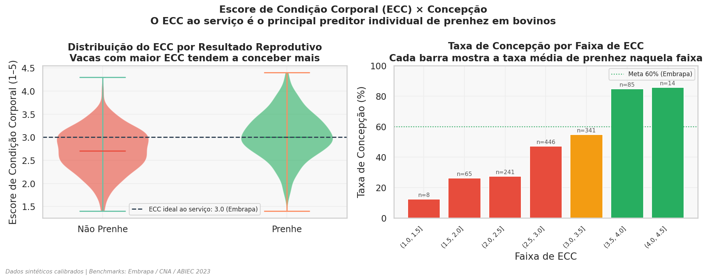

---

### 3 · Paridade × Concepção
**O que mostra:** taxa de concepção por ordem de parto e grupo de paridade.
**Para que serve:** pluríparas de 2–3 partos geralmente têm melhor desempenho; primíparas e multíparas de alta ordem precisam de atenção especial.

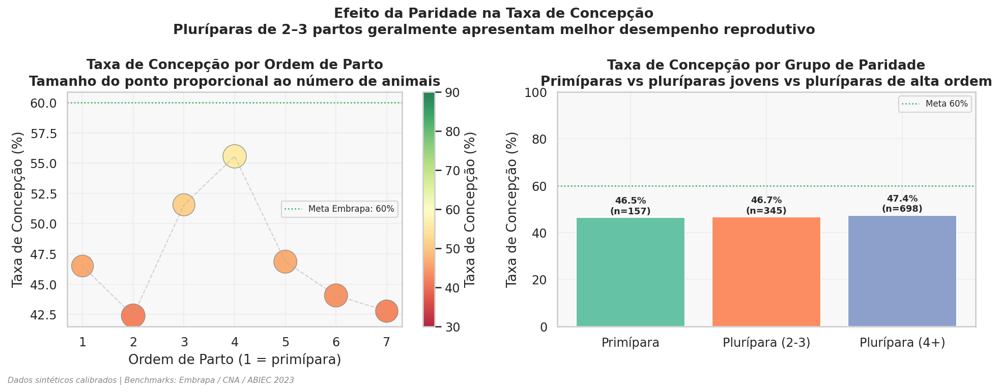

---

### 4 · Matriz de Correlação
**O que mostra:** força e direção das relações entre todas as variáveis numéricas.
**Como ler:** azul = correlação positiva | vermelho = negativa | quanto mais intenso, mais forte.
**Para que serve:** identificar rapidamente quais variáveis se associam mais com prenhez.

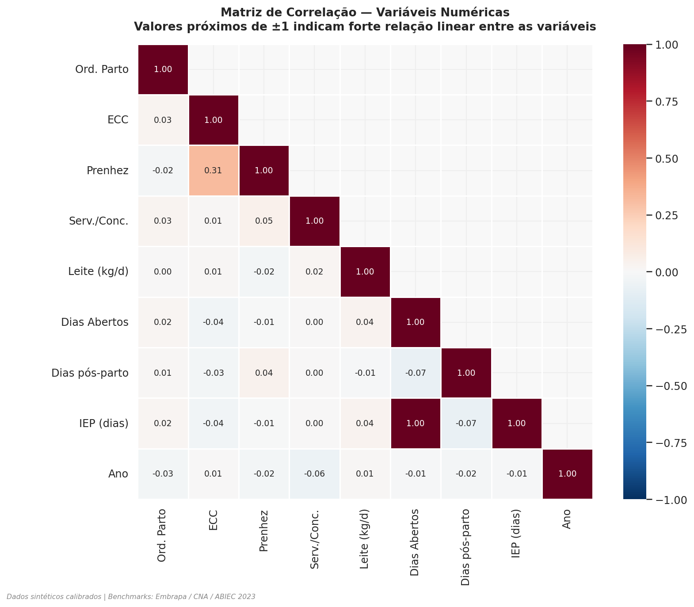

---

### 5 · Distribuição de Dias Abertos e IEP
**O que mostra:** histograma com a distribuição real de dias abertos e intervalo entre partos.
**Referências:** verde = meta Embrapa | laranja = média nacional ABIEC | vermelho = média do rebanho
**Para que serve:** a área em vermelho à direita da meta representa dias com custo operacional evitável.

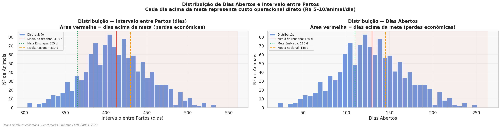

---

### 6 · Importância das Variáveis (ML)
**O que mostra:** quais variáveis o modelo de Machine Learning considera mais preditivas de prenhez.
**Modelo:** melhor entre Regressão Logística, Random Forest e Gradient Boosting (selecionado por AUC).
**Para que serve:** direcionar investimentos — se ECC lidera, o foco é nutrição; se "técnico" lidera, é capacitação.

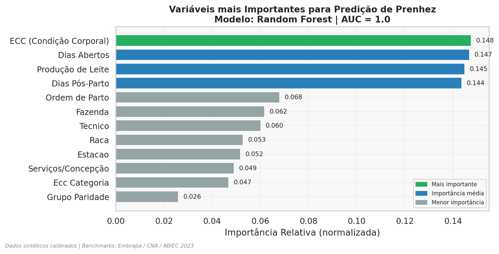

---

### 7 · Impacto Econômico Estimado
**O que mostra:** perda financeira por categoria (dias abertos, baixa concepção, serviços extras, IEP) e o ROI de um programa reprodutivo com melhoria de 10 p.p. na taxa de concepção.
**Preços:** cotação ao vivo via BCB/SGS (fallback: parâmetros CNA 2024).
**Para que serve:** traduzir métricas técnicas em linguagem financeira para tomada de decisão.

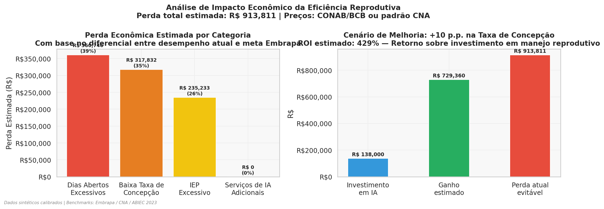

---

### 8 · Testes de Hipóteses
**O que mostra:** significância estatística de cada hipótese testada (−log₁₀ do p-value).
**Como ler:** barras **acima** da linha vermelha (α=0,05) = efeito confirmado estatisticamente.
**Para que serve:** separar diferenças reais de variação aleatória antes de agir.

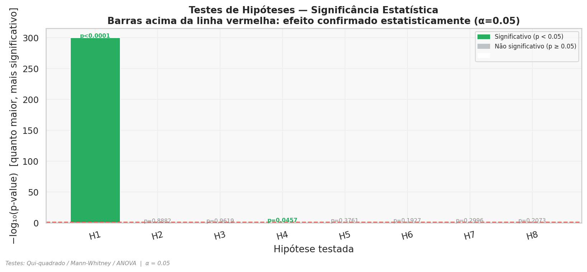

---

### 9 · Tendência Temporal da Concepção
**O que mostra:** evolução da taxa de concepção ano a ano, com intervalo de confiança 95%.
**Referências:** meta Embrapa (60%) e média nacional ABIEC 2023 (55%).
**Para que serve:** avaliar se o rebanho está melhorando ou piorando ao longo das estações de monta.

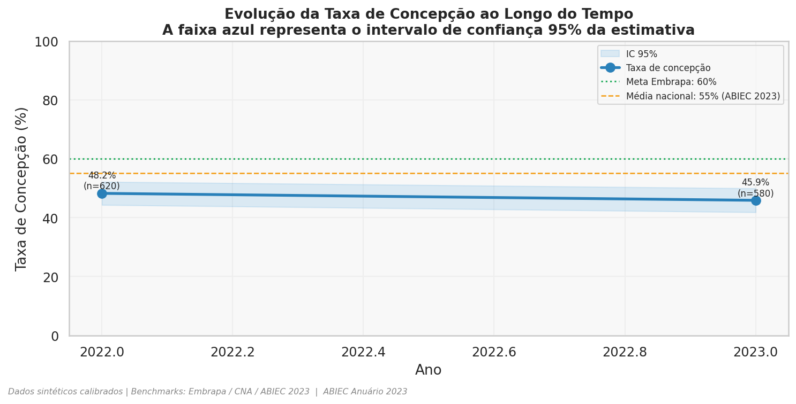

---

### 10 · Métricas por Estação do Ano
**O que mostra:** como taxa de concepção, ECC e dias abertos variam conforme a estação.
**Para que serve:** a sazonalidade é crítica em bovinos tropicais — o verão reduz fertilidade pelo estresse calórico; planejar a estação de monta conforme o clima local aumenta significativamente o desempenho.

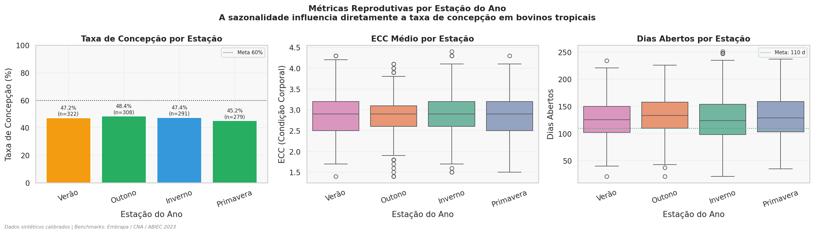

---

## Instalação e uso

```bash
pip install -r requirements.txt

# Rodar com dados sintéticos (padrão — 1.200 animais)
python orchestrator.py

# Rodar com seu dataset real (CSV, XLSX ou Parquet)
python orchestrator.py --dataset data/raw/seu_dataset.csv

# Parâmetros econômicos customizados
python orchestrator.py --dataset data/raw/seu_dataset.csv --custo-dia-aberto 10.0
```

## Usando seu próprio dataset

O pipeline normaliza colunas automaticamente. Exemplos de nomes aceitos:

| Dado | Nomes aceitos |
|---|---|
| Resultado reprodutivo | `prenhe`, `resultado_diagnostico`, `pregnant`, `concepcao` |
| ECC | `ecc`, `escore_condicao_corporal`, `bcs` |
| Data de IA | `data_inseminacao`, `data_ia`, `insemination_date` |
| Raça | `raca`, `raça`, `breed` |
| Fazenda | `fazenda`, `farm`, `propriedade` |
| Município | `municipio`, `município`, `cod_municipio`, `ibge` |

Para habilitar o enriquecimento IBGE, inclua `municipio` com o **código IBGE de 7 dígitos** (ex.: `5205109` para Cristalina-GO).

## Saídas geradas

| Arquivo | Conteúdo |
|---|---|
| `data/processed/dataset_cleaned.csv` | Dataset limpo e validado |
| `data/processed/eda_results.json` | KPIs, correlações, análise municipal IBGE |
| `data/processed/economic_impact.json` | Cálculos com preços BCB/IPEADATA |
| `outputs/models/model_results.json` | Métricas e importância de variáveis |
| `outputs/plots/*.png` | 13 gráficos (acima) |
| `outputs/reports/relatorio_reprodutivo.html` | Relatório interativo completo |
| `outputs/maps/*.png` | 3 mapas coropléticos do Brasil por estado |
| `outputs/maps/*.html` | Versão interativa (hover) dos mapas Plotly |

---

## Novas funcionalidades

### Análise Geoespacial

O `GeospatialAgent` (inserido após o `EDAAgent` no pipeline) gera três mapas coropléticos do Brasil coloridos por indicador reprodutivo, salvos em `outputs/maps/`:

| Mapa | Indicador |
|------|-----------|
| `mapa_01_taxa_concepcao_por_estado.png` | Taxa de concepção média por estado |
| `mapa_02_dias_abertos_por_estado.png` | Dias abertos médios por estado |
| `mapa_03_perda_economica_por_estado.png` | Perda econômica estimada por estado |

Os mapas usam a API GeoJSON do IBGE (`servicodados.ibge.gov.br`) para as fronteiras estaduais.  Se a API estiver indisponível ou o geopandas não estiver instalado, o agente faz fallback para gráficos de barras simples sem interromper o pipeline.

O dataset sintético inclui a coluna `estado` com distribuição proporcional ao rebanho bovino nacional (MT 14%, MG 12%, GO 11%, MS 9%, PA 8%, BA 8%, RS 7%, PR 6%, SP 5%, outros 20%).

### Dashboard Interativo (Streamlit)

```bash
streamlit run dashboard/app.py
```

O dashboard funciona de forma independente (sem necessidade de executar o pipeline antes).  Quatro abas:

- **Indicadores** — KPIs principais: prenhezes esperadas, bezerros/ano, perda por dias abertos, custo/prenhez
- **Impacto Econômico** — Comparativo gráfico: perda atual vs ganho potencial vs investimento em IA
- **Simulador IATF** — Tabela e gráficos comparando protocolo convencional vs IATF, com recomendação automática
- **Benchmarks** — Barra de progresso mostrando posição do rebanho vs metas Embrapa / CNA / ABIEC

### Simulador IATF

O módulo `src/reproductive_strategy_simulator.py` implementa a classe `IATFSimulator` para comparação econômica de protocolos:

```python
from src.reproductive_strategy_simulator import IATFSimulator, simulate_scenarios

sim = IATFSimulator(herd_size=500, base_conception_rate=0.55, calf_value=1800)
comparison = sim.compare()
roi = sim.roi_analysis()

# Ou versão simplificada para o dashboard:
result = simulate_scenarios(herd_size=500, ecc_mean=2.9, days_open=130)
```

Parâmetros calculados por protocolo: prenhezes esperadas, custo por animal, custo total, custo por prenhez, receita bruta, retorno líquido, ROI (%).

### KPIs Reprodutivos Expandidos

O `EDAAgent` agora calcula KPIs adicionais além dos originais:

| KPI | Descrição | Fórmula |
|-----|-----------|---------|
| `pregnancy_rate` | Taxa de prenhez rigorosa | prenhes / total exposto |
| `total_pregnant` | Total de prenhes confirmadas | soma prenhe=1 |
| `total_exposed` | Total de vacas expostas | len(df) |
| `spc_em_prenhes` | SPC das vacas que conceberam | média de servicos_concepcao em prenhe=1 |
| `spc_global` | SPC global do rebanho | total IA / total prenhes |
| `taxa_paricao_no_alvo` | % vacas com IEP ≤ 365 dias | (IEP≤365).sum() / n |

O método `_advanced_group_analysis` adiciona análise de SPC e taxa de parição agrupados por fazenda e técnico.

### Novos Gráficos (11-13)

---

#### 11 · Taxa de Prenhez Detalhada
**O que mostra:** prenhez por fazenda (barras) e evolução mês a mês das IAs (linha).
**Para que serve:** identificar sazonalidade e comparar fazendas lado a lado vs meta Embrapa.

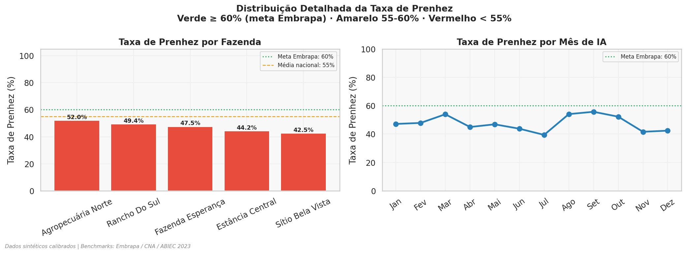

---

#### 12 · SPC por Fazenda e Técnico
**O que mostra:** Serviços por Concepção (SPC) com semáforo de cores — verde < 1,5 · amarelo 1,5–2,0 · vermelho > 2,0.
**Para que serve:** identificar ineficiências na IA por fazenda ou por técnico; SPC alto = custo de sêmen e mão-de-obra desperdiçados.

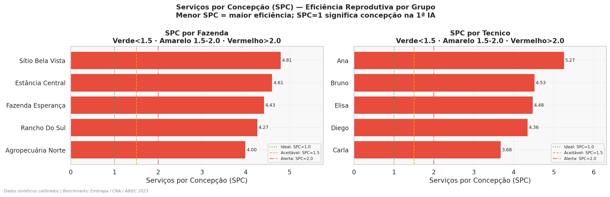

---

#### 13 · Taxa de Parição no Alvo
**O que mostra:** % de vacas com IEP ≤ 365 dias (1 bezerra/vaca/ano) por fazenda ou por ano.
**Para que serve:** o indicador mais direto de eficiência do sistema reprodutivo — maximizar a % de vacas parindo dentro do ano.

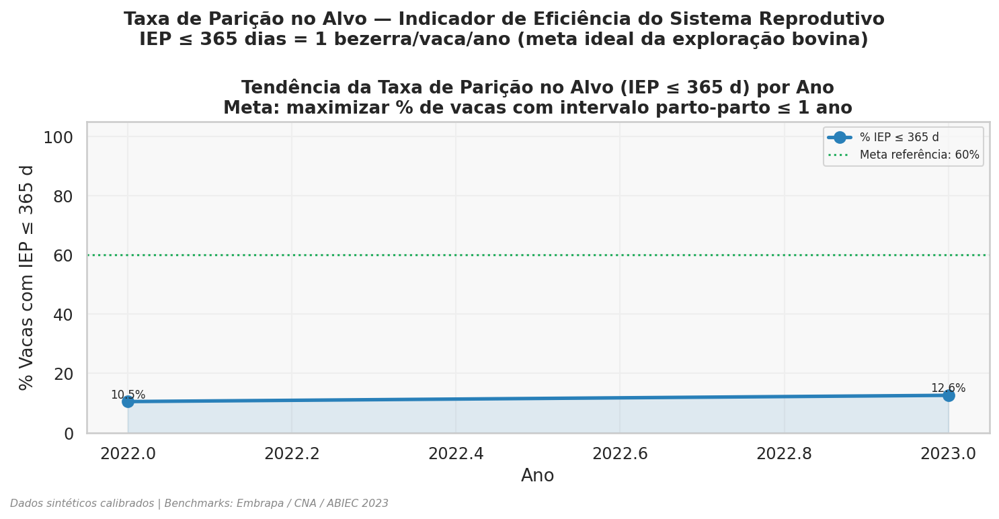

---

### Mapas Geoespaciais

Os 3 mapas coropléticos do Brasil são gerados automaticamente pelo `GeospatialAgent` usando a API GeoJSON oficial do IBGE. Versões interativas (hover) salvas como `.html`.

---

#### Mapa 1 · Taxa de Concepção por Estado
**Escala:** vermelho (baixa) → amarelo → verde (alta) | Fonte: IBGE GeoJSON + dados do rebanho

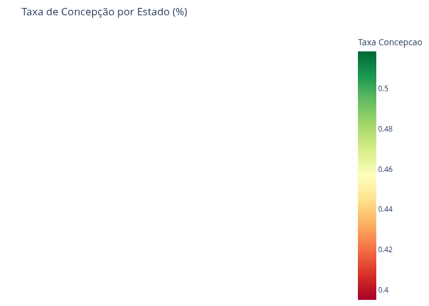

---

#### Mapa 2 · Dias Abertos Médios por Estado
**Escala:** verde (próximo da meta) → vermelho (excesso de dias abertos) | Meta CNA: 110 dias

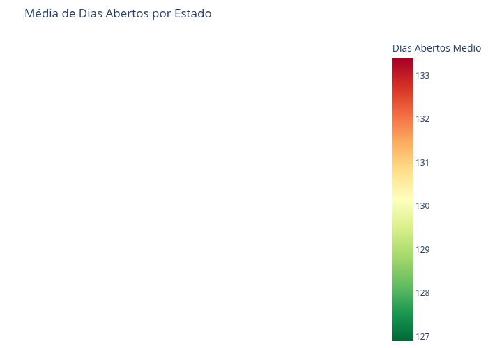

---

#### Mapa 3 · Perda Econômica por Estado
**Escala:** branco → vermelho intenso (maior perda estimada em R$) | Derivado dos dias abertos × custo/dia × rebanho

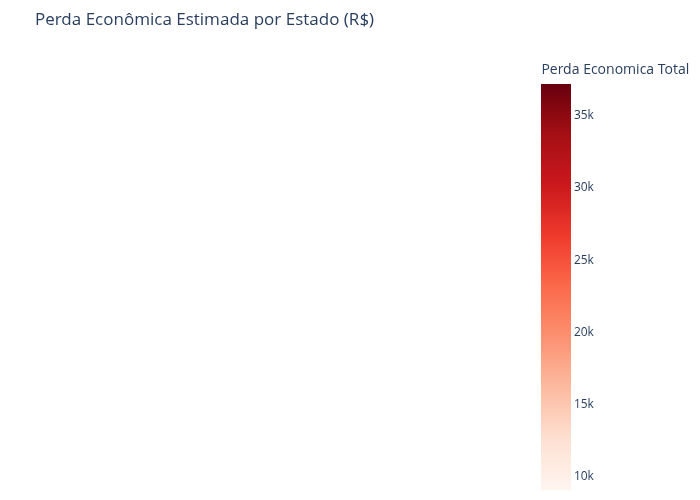
